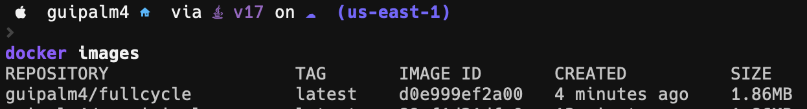

# Desafio Docker FullCycle 3.0 - Minimal Golang docker image 



1. Para testar executar comando: 
 ```bash
 docker run guipalm4/fullcycle
 ```

2. Pull na imagem:

 ```bash
 docker pull guipalm4/fullcycle
 ```

